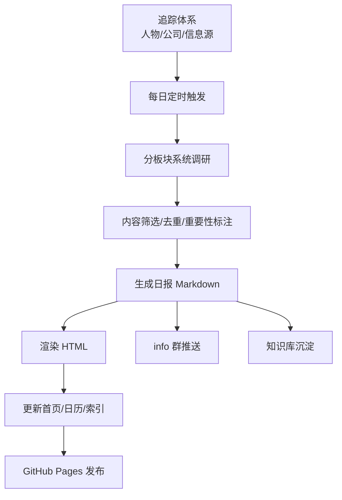
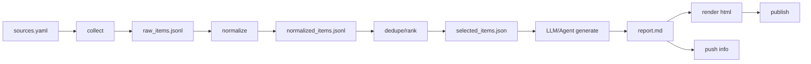
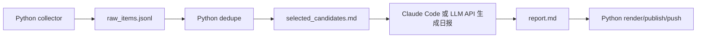

# AI 自动洞察项目上下文说明

> 目的：这份文档用于给后续接手的 AI 或工程 Agent 快速补齐上下文。它总结了当前仓库现状、我们对原项目的反推、想要达成的目标、推荐技术路线、AI Agent 介入方式、人工投入点和后续实施计划。

## 1. 背景

当前仓库是 `ai-insight-public` 的 fork，来源是公司内部分享项目“AI 洞察”的公开版。该项目的目标是持续追踪 AI 行业动态，每日/每周自动输出调研洞察，并推送到群内。

我们已经把相关介绍文档：

- `notes/link-ai-insight-project-share.md`
- `notes/link-ai-insight-project-share/images/`

这篇介绍文档中提到的核心能力包括：

- 每天追踪 85+ 位 AI 核心人物、130+ 家 AI 公司、90+ 信息源。
- 通过三层信息源体系追踪 AI 行业动态。
- 每日按五大板块生成 AI 日报。
- 对重要话题生成深度调研。
- 将日报和调研中的知识沉淀到知识库。
- 将日报通过 info 群推送。
- AI 分身“cc”拥有记忆系统、技能体系和工作流程，可以承担项目成员式任务。

我们的目标不是简单维护这个静态站，而是复刻/搭建一个类似的“AI 自动洞察系统”。

## 2. 当前仓库现状

当前仓库本质上是一个静态发布站，不是完整后端系统。

### 2.1 已有内容

根目录主要文件：

- `index.html`：公开站首页，包含 AI 日报、深度调研、追踪体系、知识库四个 Tab。
- `README.md`：说明公开版是从内部版本同步生成。
- `.nojekyll`：用于 GitHub Pages。

主要目录：

- `01-daily-reports/`：日报和周报内容，按月份组织，包含 `.md` 和 `.html` 成品。
- `02-deep-research/`：深度调研专题页面，多数是静态 HTML，小部分专题有 CSS/JS。
- `shared/common.css`：跨页面复用样式。
- `proposals/`：一些提案型页面。
- `subscribe/`：目前基本为空。
- `notes/`：我们新增的学习笔记与上下文文档目录。

### 2.2 当前仓库缺失的部分

当前公开仓库缺少真正让项目“自动运行”的后端能力：

- 没有信息源结构化配置，例如 `sources.yaml`、`people.yaml`、`companies.yaml`。
- 没有采集器，例如 RSS、搜索、官网博客、X/Twitter、Newsletter、YouTube 等。
- 没有日报生成器。
- 没有 Markdown 到 HTML 的统一渲染器。
- 没有首页索引自动更新脚本。
- 没有知识库自动沉淀逻辑。
- 没有 消息 推送脚本。
- 没有定时调度配置。
- 没有运行日志、失败重试、质量校验。
- README 中提到的 `scripts/sync_to_public.py` 不存在，说明同步逻辑在内部仓库。

因此，当前仓库更准确的定位是：

> 已生成内容的公开展示层，而不是 AI 自动洞察系统本体。

## 3. 从 notes 反推的原项目技术路线

基于 `notes/link-ai-insight-project-share.md` 和配图反推，原项目大概率是：

> AI Agent 驱动的内容生产流水线 + 静态站发布 + IM 推送系统。

它不像传统前后端服务，也不像重型爬虫系统。它更像一个每天定时运行的“研究员 Agent”。

### 3.1 原项目整体链路



### 3.2 原项目可能的工程模块

根据介绍中的“系统调研 -> 内容筛选 -> 生成报告 -> 部署上线 -> 群内推送”，原项目至少需要以下模块：

- `scheduler`：定时触发，每天早上执行。
- `researcher`：根据追踪体系和五大板块执行调研。
- `collector`：获取原始信息。
- `normalizer`：清洗来源、标题、时间、链接、正文摘要。
- `deduper`：去重，处理同一事件多源报道。
- `ranker`：按重要性、可信度、行业影响力排序。
- `writer`：生成日报 Markdown。
- `renderer`：将 Markdown 渲染成 HTML。
- `index_updater`：更新首页和日报列表。
- `publisher`：提交到 GitHub Pages 或其他静态托管。
- `notifier`：推送到 info 群。
- `kb_updater`：将有价值内容沉淀到知识库。
- `reviewer`：生成运行复盘和质量报告。

### 3.3 原项目可能的目录结构

内部仓库可能类似：

```text
ai-insight/
  scripts/
    daily_report.py
    weekly_report.py
    render_html.py
    update_index.py
    sync_to_public.py
    push_info.py
  tracking/
    people.md
    companies.md
    sources.md
  prompts/
    daily_research.md
    daily_writer.md
    deep_research.md
    knowledge_extract.md
  01-daily-reports/
  02-deep-research/
  04-knowledge-base/
  .env
```

更工程化的版本可以是：

```text
ai-insight/
  engine/
    cli.py
    config/
      sources.yaml
      people.yaml
      companies.yaml
      topics.yaml
    collectors/
      rss.py
      web_search.py
      official_blog.py
      newsletter.py
      youtube.py
    processors/
      normalize.py
      dedupe.py
      rank.py
    generators/
      daily_report.py
      weekly_report.py
      deep_research.py
      knowledge_extract.py
    renderers/
      markdown_to_html.py
      index_updater.py
    notifiers/
      info.py
    memory/
      profile.md
      project_state.json
      source_quality.db
    workflows/
      daily.yaml
      weekly.yaml
  public/
    index.html
    01-daily-reports/
    02-deep-research/
    04-knowledge-base/
```

## 4. 我们要达成的目标

### 4.1 产品目标

搭建一个可以自动或半自动运行的 AI 行业洞察系统：

- 每天自动收集 AI 行业动态。
- 过滤低质量信息。
- 按固定栏目生成日报。
- 生成可追溯、有来源、有判断的 Markdown 报告。
- 渲染成 HTML 并发布到静态站。
- 将日报摘要推送到群。
- 将高价值内容沉淀到知识库。
- 每天或每周生成运行复盘，持续优化信息源和提示词。

### 4.2 技术目标

第一阶段不追求复杂服务化，而是优先做一套可靠的批处理 pipeline：



### 4.3 运行目标

推荐先采用人审模式：

```text
08:00 自动采集和生成草稿
08:30 生成日报 Markdown
08:40 人工审阅 5-15 分钟
08:50 一键发布
09:00 推送到群
```

稳定后再改为半自动或全自动：

```text
普通日报自动推送
高风险日报进入人工审核
每日生成 run_review.md
每周人工复盘一次
```

高风险日报包括：

- 政策/监管类新闻。
- 公司负面新闻。
- 融资金额、估值等数字敏感内容。
- Benchmark、模型能力排名。
- 来源不足。
- Agent 自评置信度低。

## 5. 推荐架构方案

### 5.1 是否前后分离

不建议一开始做传统前后分离。

原因：

- 当前系统没有实时用户请求。
- 核心是每天定时生产内容，不是在线 API 服务。
- 页面是静态展示，GitHub Pages 就足够。
- 后台生成逻辑更像 ETL/批处理/内容生产流水线。

第一阶段建议：

> 同仓库，逻辑分层，脚本化运行。

后续如果需要公开发布和保护密钥，再拆仓库：

```text
ai-insight-engine-private   # 采集、LLM、推送、密钥、工作流
ai-insight-public           # 只放生成后的 HTML/MD 静态页面
```

### 5.2 为什么建议先同仓库

优点：

- 上手快。
- 不需要跨仓库同步。
- 方便 AI Agent 在一个工作区内读写内容。
- 适合本地跑通 MVP。

缺点：

- 密钥容易混入仓库。
- 公开发布时需要额外脱敏。
- 生成器和展示层耦合。

因此，同仓库只适合原型期。进入稳定期后，应拆成私有 engine 仓库和公开 public 仓库。

## 6. AI Agent 应该介入哪些环节

原则：

> 代码负责确定性流程，Agent 负责认知密集型任务。

### 6.1 适合 Agent 介入的环节

#### 6.1.1 重要性判断

Agent 可以阅读候选资讯，判断：

- 是否属于 AI 行业重要变化。
- 属于哪个板块。
- 是重大、值得关注，还是普通噪声。
- 为什么值得关注。
- 是否需要进入深度调研池。

输出示例：

```json
{
  "title": "某模型发布",
  "category": "大模型",
  "importance": "high",
  "reason": "首次在某 benchmark 超过头部闭源模型",
  "confidence": 0.82,
  "need_deep_research": true
}
```

#### 6.1.2 语义去重

普通代码可以按 URL、标题、发布时间去重，但语义重复需要 Agent：

- 同一模型发布被多家媒体报道。
- 同一融资事件有多个来源。
- 同一人物观点被二次转载。

Agent 可以将重复报道合并成一个事件，并保留多个来源。

#### 6.1.3 日报生成

Agent 很适合生成 Markdown 日报：

- 今日热点。
- 五大板块。
- 每条资讯摘要。
- 深度聚焦。
- 数据快照。
- 观察清单。

输入应是结构化候选信息，不要让 Agent 完全自由搜索后直接写最终稿。

推荐输入：

```text
今天时间窗口：
候选事件列表：
来源链接：
历史日报摘要：
写作规范：
质量标准：
```

#### 6.1.4 趋势洞察

Agent 适合做跨事件归纳：

- 这几条新闻共同指向什么趋势。
- 哪些公司策略正在变化。
- 哪些技术方向开始升温。
- 后续应该观察什么指标。

#### 6.1.5 知识库沉淀

Agent 可以从日报中提取：

- 人物画像更新。
- 公司画像更新。
- 模型能力矩阵更新。
- Agent 概念和最佳实践。
- 企业 AI 转型案例。

但知识库写入建议先进入草稿，由人工审核。

#### 6.1.6 每日复盘

Agent 可以在每日任务结束后生成：

```text
runs/2026-05-06/run_review.md
```

内容包括：

- 今日采集了多少信息。
- 最终采用多少条。
- 哪些来源质量高。
- 哪些来源噪声大。
- 哪些板块信息不足。
- 哪些 Prompt 需要调整。
- 是否发生失败或人工修正。

### 6.2 不适合 Agent 主导的环节

以下环节应尽量用确定性代码完成：

- 定时触发。
- API/RSS 拉取。
- 文件读写。
- Markdown 渲染 HTML。
- 首页索引更新。
- Git commit/push。
- info webhook 调用。
- 链接检查。
- 日志记录。
- 失败重试。

原因：

- 这些任务可用代码稳定完成。
- 让 Agent 执行会增加不可控性。
- 失败时难以重放和排查。

## 7. 如何接入本地 Claude Code 或自己的 API

### 7.1 使用本地 Claude Code

如果本机已安装 Claude Code，可以把它当作一个可被脚本调用的 Agent 执行器。

可能方式：

```bash
claude -p "$(cat prompts/daily_writer.md runs/2026-05-06/selected_items.md)" \
  --cwd /path/to/ai-insight \
  --allowedTools "Read,Write,WebSearch" \
  --output-format json
```

适合：

- 本地原型。
- 需要 Agent 读写仓库文件。
- 需要使用 Claude Code 的工具能力。
- 需要模拟“AI 项目成员”的工作方式。

风险：

- 本机需要保持在线。
- 权限要收紧，不能让 Agent 随便改文件。
- 自动化运行时需要考虑授权、登录态、API Key。

### 7.2 使用模型 API 自己封装

更工程化方式是自己写 `llm_client.py`：

```text
engine/
  llm/
    client.py
    prompts.py
    schemas.py
```

优点：

- 可部署到服务器。
- 输出结构更可控。
- 易于记录 token、成本、延迟、错误。
- 可切换不同模型。

缺点：

- 需要自己实现工具调用、上下文管理和错误处理。
- 没有 Claude Code 那种直接读写仓库的便利。

### 7.3 推荐混合模式

推荐第一阶段使用混合模式：



这样做的好处：

- 采集、渲染、推送等确定性任务稳定。
- 重要性判断、写作、沉淀由 Agent 完成。
- 整体可重跑、可观测、可逐步替换。

## 8. 人工需要投入精力的地方

### 8.1 追踪体系维护

这是最核心的人类判断。

需要人工决定：

- 追踪哪些人物。
- 哪些人属于 L1/L2/L3。
- 追踪哪些公司。
- 哪些信息源可信。
- 哪些信息源噪声过大。
- 哪些中文/英文渠道值得加入。

Agent 可以建议新增或降权，但最终判断应由人负责。

### 8.2 质量标准定义

需要人工定义什么是“高质量洞察”：

- 必须有来源。
- 必须区分事实、推测、判断。
- 必须说明为什么重要。
- 不能只搬运新闻。
- 不能过度营销化。
- 不能生成没有来源的数据。
- 要覆盖五大板块，但不强行凑数。

这些标准应该写成 Prompt 和规则文件。

### 8.3 Prompt 和模板调优

需要人工持续优化：

- 日报结构。
- 语气风格。
- 板块名称。
- 重要性等级。
- 数据快照格式。
- 观察清单格式。
- info 卡片文案。
- 深度调研模板。

第一周人工成本会比较高，后面逐渐降低。

### 8.4 事实校验

尤其在自动推送前，人工需要关注：

- 公司名、人物名是否准确。
- 模型名、版本号是否准确。
- 日期是否在时间窗口内。
- 融资金额、估值、用户数等数字是否有来源。
- Benchmark 是否被误读。
- 是否把传闻写成事实。
- 来源链接是否可访问。

### 8.5 知识库归档

Agent 可以抽取知识点，但人需要判断：

- 是否值得沉淀。
- 放到哪个维度。
- 是否和已有知识重复。
- 是否需要重构旧文档。
- 是否形成了稳定观点，而不是一时新闻。

### 8.6 推送责任

一旦推送到群里，就代表项目背书。

建议早期不要全自动推送，而是：

```text
自动生成日报
自动生成推送卡片
人工确认
一键推送
```

稳定后再逐步全自动。

## 9. 推荐落地路线

### Phase 0：整理当前公开站

目标：

- 理解当前页面结构。
- 明确哪些文件是生成物。
- 补齐本地学习文档。

已完成：

- 读取当前仓库结构。
- 拉取 Docs 项目说明。
- 保存到 `notes/`。
- 初步反推原项目技术路线。

### Phase 1：最小日报生成器

目标：

- 手工维护少量信息源。
- 自动生成一篇日报 Markdown。

建议实现：

```text
engine/config/sources.yaml
engine/collectors/rss.py
engine/collectors/web_search.py
engine/processors/dedupe.py
engine/generators/daily_report.py
engine/cli.py
```

输出：

```text
runs/YYYY-MM-DD/raw_items.jsonl
runs/YYYY-MM-DD/selected_items.json
01-daily-reports/YYYY-MM/YYYY-MM-DD.md
```

### Phase 2：HTML 渲染和首页更新

目标：

- Markdown 自动转 HTML。
- 自动更新首页最新日报、日历数据和日报列表页。

建议实现：

```text
engine/renderers/markdown_to_html.py
engine/renderers/update_home_index.py
engine/renderers/update_daily_index.py
```

输出：

```text
01-daily-reports/YYYY-MM/YYYY-MM-DD.html
index.html
01-daily-reports/index.html
```

### Phase 3：info 推送

目标：

- 生成 info 卡片摘要。
- 支持人工确认后推送。

建议实现：

```text
engine/notifiers/info.py
engine/generators/info_card.py
```

配置：

```text
.env
info_WEBHOOK_URL=...
info_SECRET=...
```

### Phase 4：知识库沉淀

目标：

- 从日报中抽取高价值知识点。
- 生成知识库草稿。

建议目录：

```text
04-knowledge-base/
  01-models/
  02-agents/
  03-ai-companies/
  04-enterprise-ai/
  entity-profiles/
```

### Phase 5：定时运行和自动发布

目标：

- 本机或服务器定时运行。
- 自动 commit 产物。
- 生成运行日志。

可选方案：

- 本机 `cron` / macOS `launchd`。
- GitHub Actions。
- VPS + cron/systemd。
- 私有 CI。

推荐顺序：

```text
本机手动运行
-> 本机定时运行
-> 服务器/CI 定时运行
-> 全自动发布和推送
```

## 10. 运行与可观测性设计

每次运行都应产生一个 `run_id`，例如日期：

```text
runs/2026-05-06/
  raw_items.jsonl
  normalized_items.jsonl
  selected_items.json
  report.md
  report.html
  info_card.json
  run.log
  run_review.md
```

这样做的原因：

- 可以定位失败步骤。
- 可以复用中间产物。
- 可以比较不同 Prompt 的效果。
- 可以追踪来源质量。
- 可以为 Agent 提供长期记忆。

## 11. 记忆系统、技能体系、工作流程的工程化理解

### 11.1 记忆系统

“记忆系统”不是模型自己记住，而是工程上提供持久化上下文。

建议目录：

```text
engine/memory/
  profile.md
  project_state.json
  source_quality.md
  editorial_style.md
  known_entities/
    people/
    companies/
```

内容包括：

- 用户偏好。
- 写作风格。
- 信息源质量。
- 历史日报摘要。
- 已知人物和公司画像。
- 常见判断框架。
- 上一次运行状态。

### 11.2 技能体系

“技能体系”可以理解为受控工具集合。

例如：

```text
skills/
  fetch_rss
  search_web
  render_markdown
  update_index
  push_info
  pull_docs
  publish_github_pages
```

每个技能应该有：

- 输入 schema。
- 输出 schema。
- 权限说明。
- 失败重试策略。
- 日志记录。

### 11.3 工作流程

“工作流程”就是固定 DAG，不应完全交给 Agent 自由发挥。

推荐主流程：

```text
collect
-> normalize
-> dedupe
-> rank
-> generate_report
-> verify
-> render
-> publish
-> notify
-> reflect
```

Agent 可以在其中几个节点发挥，但整体流程应由代码或 workflow 编排。

## 12. 对后续 AI 的工作指令

如果后续 AI 接手本项目，应先理解：

1. 当前仓库是静态发布层，不是完整自动化系统。
2. `notes/link-ai-insight-project-share.md` 是原项目介绍文档。
3. 本文档是我们对目标系统和技术路线的总结。
4. 不要直接把当前仓库改成复杂 Web 服务。
5. 优先实现批处理式后台生成器。
6. 先跑通本地 MVP，再考虑服务器和全自动化。
7. Agent 负责判断、写作、沉淀，代码负责采集、渲染、发布、推送。
8. 早期推送必须人工审核，稳定后再放权。
9. 所有自动生成内容都应保留来源、时间窗口和运行日志。
10. 修改仓库文件时要遵守 AGENTS.md 中的 MCP 编辑记录规则。

## 13. 下一步建议

下一步可以让 AI 继续做以下任务之一：

1. 设计 `engine/` 目录结构和最小配置文件。
2. 编写 `sources.yaml` 样例。
3. 编写日报 Markdown 模板。
4. 编写 `generate_daily.py` 的 MVP。
5. 编写 Markdown 到 HTML 的渲染脚本。
6. 修复当前首页中知识库链接 404 的问题。
7. 将当前手写 `index.html` 中的数据抽成 JSON，再由脚本生成。

优先级建议：

```text
P0：sources.yaml + generate_daily.py + report.md
P1：render_html.py + update_index.py
P2：push_info.py
P3：knowledge_extract.py
P4：CI/定时调度
```

