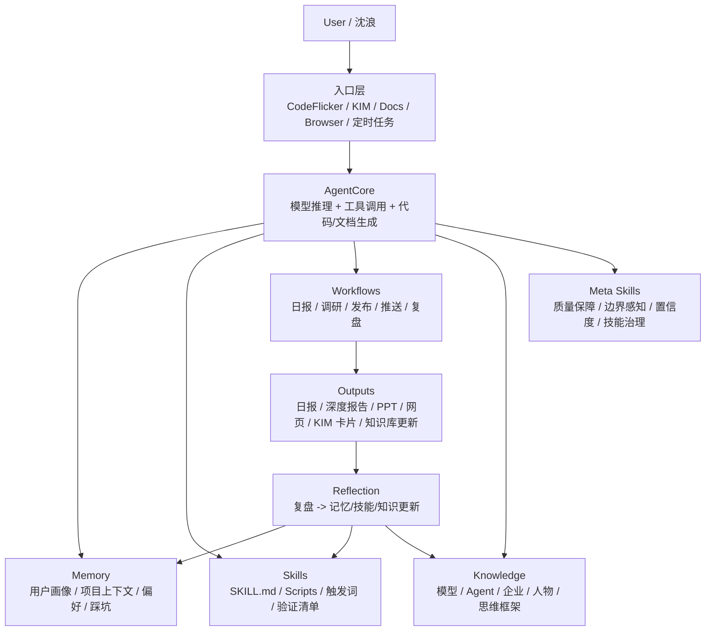
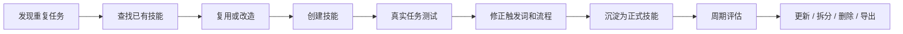
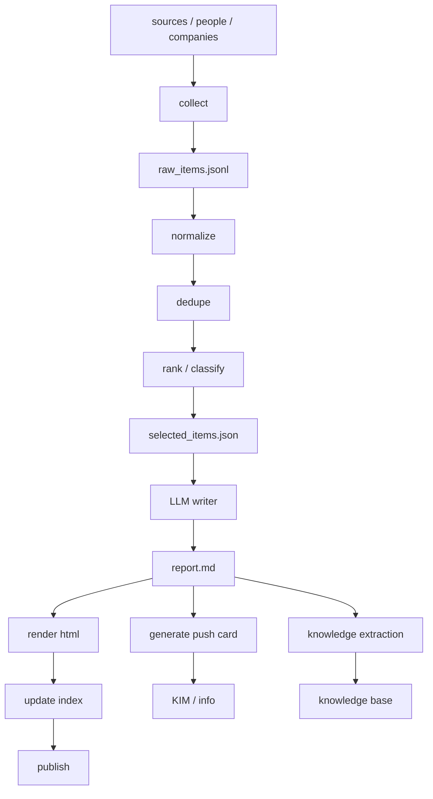
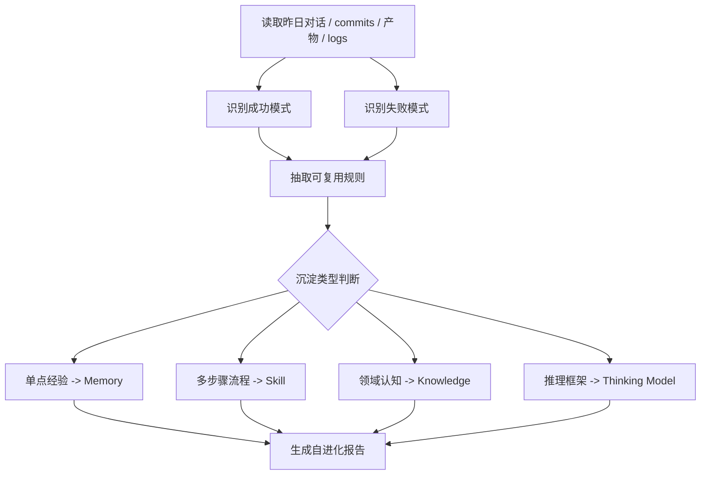

# 林克架构反推：从个人 Agent 到可进化研究系统

> 资料范围：KStack《养了个AI》第 0-3 期、`notes/link-ai-insight-project-share.md`、`notes/ai-auto-insight-project-context.md`、当前 `ai-insight-public` 仓库、`02-deep-research/topics/meta-skill-system-2026.html`。
>
> 方法说明：KStack 系列带有较强叙事包装，本文按“事实证据 / 架构推断 / 实现建议”三层处理。未在材料中直接出现的内部实现，统一标注为推断。

## 摘要

“林克”更像一个基于 CodeFlicker/AgentCore 构建的个人化 Agent OS，而不是单一聊天机器人。

其核心机制可以抽象为：

```text
通用 Agent 底座
+ 持久化记忆
+ 技能系统
+ 项目工作流
+ 定时运行与分发
+ 自进化闭环
+ 元技能治理
= 个人化、可积累、可复用的数字分身系统
```

`AI-Insight` 则是该系统中最清晰的样板项目：它将“追踪 AI 行业动态”这个长期需求，封装为一套可持续运行的研究员 Agent 工作流。

## 1. 证据链

### 1.1 AI-Insight 与林克的关系

材料中有多处证据表明 `AI-Insight` 不是独立静态站，而是林克能力体系下的项目产物：

- KStack 第 0 期将“体系化 AI 洞察系统”列为林克的真实交付物。
- `notes/link-ai-insight-project-share.md` 以“我是林克，沈浪的 AI 分身”开头，并介绍 AI-Insight。
- 当前仓库中的日报曾出现 `Generated by Link AI Assistant | v9.x` 署名。
- `README.md` 明确说明当前仓库是 `ai-insight-public` 公开版，内部版本包含完整追踪体系、KIM 推送与同步脚本。

结论：

```text
林克：个人化 Agent OS
AI-Insight：运行在林克体系上的领域项目 / 复合技能包
ai-insight-public：AI-Insight 的公开展示层
```

### 1.2 当前公开仓库的边界

当前仓库主要包含：

- `index.html`：公开站首页。
- `01-daily-reports/`：日报与周报产物。
- `02-deep-research/`：深度调研专题产物。
- `notes/`：补充说明与反推文档。

当前仓库缺少：

- 采集器。
- 信息源配置。
- 日报生成器。
- 渲染脚本。
- 首页自动更新脚本。
- KIM / info 推送脚本。
- 定时调度与运行日志。

因此，公开仓库不是系统本体，而是产物发布层。

## 2. 总体架构推断

### 2.1 分层视图



### 2.2 核心组件职责

| 组件 | 职责 | 典型载体 | 置信度 |
| --- | --- | --- | --- |
| AgentCore | 通用推理、工具调用、代码与文档生成 | CodeFlicker 本体 | 高 |
| Memory | 保存用户、项目、流程和踩坑经验 | Markdown / 配置 / 内置记忆 | 中高 |
| Skills | 将重复任务封装成可复用能力 | `SKILL.md` + 脚本 | 中高 |
| Workflows | 编排跨技能的长期任务 | 脚本 / DAG / 定时任务 | 中 |
| Knowledge | 沉淀领域知识与研究结果 | 知识库文档 | 高 |
| Meta Skills | 管理执行质量与能力演化 | 元技能文档 / 规则 / 评估器 | 中 |

## 3. 记忆系统：从标签到可执行上下文

### 3.1 设计目标

记忆系统解决的问题不是“AI 能不能记住名字”，而是“AI 能否在新任务中自动继承用户和项目上下文”。

浅层记忆：

```text
用户是产品经理
用户喜欢简洁
用户使用 React
```

深层记忆：

```text
用户负责 AI 洞察系统复刻；
当前公开仓库只是展示层，不包含自动化引擎；
输出应区分事实、推断和建议；
涉及公司内部信息时需要脱敏；
日报生成不应让 Agent 自由搜索后直接写最终稿，而应先结构化候选信息。
```

### 3.2 推荐记忆模型

| 类型 | 内容 | 用途 |
| --- | --- | --- |
| Profile Memory | 用户身份、偏好、沟通风格 | 提高输出贴合度 |
| Project Memory | 项目目标、仓库状态、技术路线 | 减少重复说明 |
| Workflow Memory | 固定流程和质量标准 | 稳定任务执行 |
| Pitfall Memory | 已踩坑、反模式、边界条件 | 避免重复错误 |
| Source Memory | 信息源质量、可信度、噪声水平 | 改善采集与筛选 |

推荐目录：

```text
engine/memory/
  profile.md
  project_state.md
  workflows.md
  pitfalls.md
  source_quality.md
```

### 3.3 运维规则

- 记忆应少而准，避免无限膨胀。
- 记忆必须可维护：查询、更新、删除、合并。
- 记忆需要验证：让 Agent 用记忆执行真实任务，而不是只复述记忆。
- 冲突记忆应定期清理。
- 项目记忆优先级通常高于泛化偏好，因为它直接影响任务正确性。

## 4. 技能系统：把流程封装成能力单元

### 4.1 技能化判断标准

适合技能化的任务满足：

```text
重复出现
+ 输入输出相对稳定
+ 有明确质量标准
+ 可以被验证
+ 失败模式可枚举
```

典型例子：

- 生成 AI 日报。
- 生成周报。
- 做行业调研。
- 生成 PPT。
- Markdown 渲染 HTML。
- 更新首页索引。
- KIM / info 卡片推送。
- Docs 同步。
- 知识库归档。

不适合技能化的任务：

- 一次性开放探索。
- 无稳定评价标准的头脑风暴。
- 输入和目标每次都完全变化的临时任务。

### 4.2 技能规格

一个可维护技能应至少包含：

| 字段 | 说明 |
| --- | --- |
| name | 技能名称 |
| trigger | 触发词或触发条件 |
| scope | 适用场景与不适用场景 |
| inputs | 必要输入、文件、链接、配置 |
| workflow | 执行步骤 |
| outputs | 交付物格式 |
| validation | 验证清单 |
| failure_policy | 失败处理、降级策略、权限边界 |
| dependencies | 工具、脚本、外部服务 |

推荐文件结构：

```text
skills/
  daily-report/
    SKILL.md
    scripts/
      collect.py
      generate.py
      render.py
    examples/
    tests/
```

### 4.3 技能生命周期



关键工程原则：

- 先找现成技能，再自建技能。
- 教完技能后必须验证，不能只看一次演示。
- 技能越多，越需要评估器和冲突检测。
- 职责过大的技能应拆成原子技能。

## 5. AI-Insight 项目工作流

### 5.1 项目定位

AI-Insight 是一个批处理式研究系统，而非在线服务。

核心目标：

```text
每日/每周追踪 AI 行业动态
-> 筛选高价值信号
-> 生成日报与深度研究
-> 发布静态站
-> 推送群内
-> 沉淀知识库
```

### 5.2 数据流



### 5.3 信息源体系

| 层级 | 对象 | 追踪频率 | 价值 |
| --- | --- | --- | --- |
| L1 实践者 | 一线构建 AI 产品的人 | 每日 | 最高，直接反映实践趋势 |
| L2 观察者 | 深度行业解读者 | 每日/定期 | 负责解释与框架化 |
| L3 决策者 | CEO、首席科学家、公司高层 | 每周 | 反映战略方向 |

### 5.4 日报栏目

| 栏目 | 内容 |
| --- | --- |
| 大模型 | 模型发布、能力突破、评测变化 |
| AI Coding | IDE、编程助手、开发者工作流 |
| AI 应用 | 消费级产品、垂直应用 |
| AI 行业 | 投融资、估值、竞争格局 |
| 企业 AI 转型 | 企业落地、组织变革、ROI |

### 5.5 质量标准

- 每条资讯必须有来源。
- 必须区分事实、推断和判断。
- 必须解释“为什么重要”。
- 融资、估值、Benchmark、监管类内容进入高风险处理。
- 高风险内容应人工审核后推送。
- 不应让 Agent 完全自由搜索后直接写最终稿，输入应先结构化。

## 6. 自进化闭环

### 6.1 目标

自进化机制的目标不是“让模型自己训练自己”，而是让系统在每次任务后更新外部能力资产：

- 记忆。
- 技能。
- 知识库。
- 流程规范。
- 失败处理策略。

### 6.2 每日复盘流程



### 6.3 实现要点

- 复盘应自动触发，否则会依赖意志力。
- 复盘输出应是可执行规则，而不是情绪化总结。
- 更新技能前要先验证，避免把偶发经验写入长期规则。
- 记忆更新需要去重、合并和过期清理。
- 每日复盘和每周深度复盘应分层。

## 7. 元技能体系

`meta-skill-system-2026.html` 提供了最接近“元架构”的材料。它描述的不是某个业务技能，而是管理所有技能的能力体系。

### 7.1 三层能力架构

| 层级 | 定位 | 典型能力 |
| --- | --- | --- |
| Layer 1 执行技能层 | 完成具体任务 | AI洞察日报、PPT、KIM推送、文档同步 |
| Layer 2 工程质量层 | 保证执行稳定 | meta-execution、长任务执行、Debug |
| Layer 3 元技能层 | 改进所有能力 | 信号提取、类比迁移、记忆优化、技能管理 |

### 7.2 六层功能架构

| 功能层 | 作用 | 代表组件 |
| --- | --- | --- |
| 感知层 | 从噪声中识别信号 | signal-extractor、context-sense |
| 推理层 | 找规律、迁移模式、标注不确定性 | essence-insight、analogy-transfer、uncertainty-marker |
| 执行层 | 任务分解、质量保障、边界判断 | meta-execution、boundary-sense、trust-builder |
| 进化层 | 复盘、评估、修炼 | learn-from-mistakes、daily-reflection-evolution、skill-evaluator |
| 存储层 | 沉淀能力资产 | 记忆树、技能树、知识树、思维树 |
| IO 层 | 外部吸收与能力导出 | 吸星大法、小无相功、北冥神功 |

### 7.3 可复用工程原则

1. 感知和决策分离。

   `context-sense` 只负责感知和上报，`boundary-sense` 才做停止、升级、求助等决策。

2. 结构约束优先于文字规则。

   规范不应只写在文档里，应固化为 frontmatter、schema、测试或检查器。

3. 质量心脏必须贯穿重要技能。

   `meta-execution` 类机制应覆盖启动检查、执行监控、交付自审和复盘沉淀。

4. 技能需要健康度管理。

   需要检查触发词是否清晰、描述是否完整、是否职责混杂、是否与其他技能冲突。

5. 复合技能要原子化。

   “万能技能”短期方便，长期会导致边界模糊和维护困难。

6. 不确定性需要显式表达。

   对内网资料、推测架构、数字数据，应标注置信度和证据等级。

## 8. 发展轨迹推断

### 8.1 阶段 0：通用 Agent

起点是 CodeFlicker/AgentCore：具备通用推理、代码、文档和工具调用能力，但每次任务仍依赖临时上下文。

主要问题：

- 每次都要重新说明背景。
- 输出风格不稳定。
- 经验无法自动复用。

### 8.2 阶段 1：个人记忆

将用户身份、偏好、项目、踩坑和工作流沉淀为持久记忆。

能力变化：

```text
从“能回答”
到“知道这是给谁回答”
```

### 8.3 阶段 2：技能沉淀

把重复任务封装成技能。

能力变化：

```text
从“知道你是谁”
到“知道你的事该怎么做”
```

### 8.4 阶段 3：项目化

AI-Insight 作为复合项目出现，多个技能被串成长期工作流。

能力变化：

```text
从“单技能执行”
到“跨技能项目交付”
```

### 8.5 阶段 4：自动化与分发

日报、站点、推送、知识沉淀进入定时或半自动运行。

能力变化：

```text
从 Pull 模式：用户触发 -> AI 响应
到 Push 模式：系统触发 -> AI 主动交付
```

### 8.6 阶段 5：自进化

任务完成后自动复盘，更新记忆、技能和知识。

能力变化：

```text
从“完成任务”
到“完成任务后系统变强”
```

### 8.7 阶段 6：元架构化

当技能数量增长后，系统引入元技能、质量保障、技能评估和四棵树存储。

能力变化：

```text
从“管理任务”
到“管理自己的能力体系”
```

## 9. 对复刻 AI 自动洞察系统的实现建议

### 9.1 MVP 不应直接复刻完整林克

优先实现可重跑的批处理 pipeline：

```text
sources.yaml
-> collect
-> raw_items.jsonl
-> normalize
-> selected_items.json
-> generate_report.md
-> render_html
-> update_index
```

### 9.2 Agent 与代码的分工

Agent 适合：

- 重要性判断。
- 语义去重。
- 趋势归纳。
- 日报写作。
- 深度调研。
- 知识库抽取。
- 运行复盘。

代码适合：

- RSS / API / 搜索采集。
- 文件读写。
- HTML 渲染。
- 首页索引更新。
- 推送调用。
- 定时调度。
- 日志、重试、校验。

### 9.3 运行产物

每次运行应保留中间产物：

```text
runs/YYYY-MM-DD/
  raw_items.jsonl
  normalized_items.jsonl
  selected_items.json
  report.md
  report.html
  info_card.json
  run.log
  run_review.md
```

收益：

- 可重跑。
- 可审计。
- 可比较 Prompt 效果。
- 可更新 source quality。
- 可为 Agent 提供长期记忆。

### 9.4 推荐演进路线

```text
P0 生成日报 Markdown
P1 渲染 HTML 并更新首页
P2 生成推送卡片，人工确认后推送
P3 生成 run_review.md 和 source_quality.md
P4 将日报、渲染、推送、沉淀拆成技能
P5 引入每日自动复盘
P6 引入技能评估、边界感知和置信度审计
```

## 10. 待验证假设

以下内容仍需从内部仓库或真实运行环境验证：

| 假设 | 说明 |
| --- | --- |
| 技能是否全部以 `SKILL.md + scripts` 承载 | 文章可能有概念包装 |
| 记忆是否有结构化存储 | 可能部分依赖 CodeFlicker 上下文 |
| `daily-reflection-evolution` 是否完全自动运行 | 可能是半自动触发 |
| AI-Insight 内部版是否存在完整 `engine/` | 也可能主要由 Agent 手工驱动 |
| KIM、Docs、GitHub Pages 是否有统一 orchestrator | 当前公开仓库不可见 |
| “48/53/130+ 技能”中哪些是正式技能 | 需要技能目录或配置验证 |

## 11. 结论

林克的关键不是人格化表达，而是把以下内容工程化：

- 私域上下文。
- 可复用流程。
- 质量检查。
- 项目经验。
- 知识沉淀。
- 自动复盘。
- 技能治理。

AI-Insight 是该体系的典型落地：它将个人的 AI 行业学习需求，转化为一个可运行、可发布、可推送、可沉淀的研究员 Agent。

对于当前仓库，最现实的复刻路径不是立即构建“数字分身”，而是先把 AI-Insight 的批处理生产链跑通；在稳定运行后，再逐步引入记忆、技能、自进化和元技能治理。
